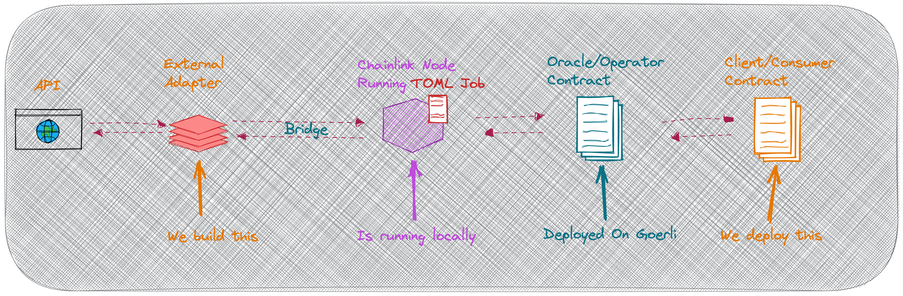

# INTRODUCTION

This repo is for the [Chainlink Fall 2022 Hackathon](https://chain.link/hackathon). This demo shows you how to Build an External Adapter that bridges to a Chainlink Oracle Node so that your smart contracts can fetch arbitrary data from an external API. You can read about [External Adapters](https://docs.chain.link/docs/external-adapters/) here.

This demo's video has a [Youtube Livestream](https://youtu.be/TjG14J38M2A)

# Recommended Prerequisites

- You have some programming experience (untyped languages is fine).

- Metamask account, with Goerli Eth and Goerli Link (get both from [Chainlink Faucets](faucets.chain.link))

- You have a running local Chainlink Node. You can follow along with [this live stream](https://youtu.be/4tIgRvc8WxQ) to do that. In this demo, I already have a Chainlink node up and running on my machine and so my External Adapter is able to interact with it.

# Repo Structure

There are three branches

- `1_start_here`: As the name suggests we start the demo here. Clone this repo on this branch and it sets you up with the `package.json` dependencies and the `tsconfig.json` basic setup. We will use typescript so you can follow the External Adapter's input and output data structures better. This branch also has a `ConsumerContract.sol` which is our calling contract. This contract calls an Operator/Oracle contract that is associated with the Chainlink Node. Scroll further in this README to see how the architecture works.

- `2_ea_server` This branch has the code for the External Adapter Express JS server that we code in the live demo. The project is in TypeScript, but is simple enough that JS developers will be able to follow along.

- `3_advanced_ea_server` This has a JavaScript only implementation of a more advanced External Adapter Express JS server that uses [this template](https://github.com/thodges-gh/CL-EA-NodeJS-Template) which includes much more sophisticated error handling, logging, retry logic, input and output data validation etc.

  > :note ⚠️⚠️⚠️ This is not covered in the Live Demo, but is provided for convenience. You can see a previous live stream of implementing this sort of template [here](https://www.youtube.com/watch?v=fICFYsN4E74).

  > **Note further** that the video I linked to covers a different API (Halo game API) whereas this repo and this implementation in branch 3 covers fetching data from [http://numbersapi.com/](http://numbersapi.com/).

# Getting Started

Clone this repo with `git clone https://github.com/zeuslawyer/cl-fall22-external-adapters.git` and make sure you're in the `1_start_here` branch. Then run `yarn install` to install the dependencies.

# External Adapter Data Structures

## Request Data

Requests to External Adapters conform to the following structure ([docs](https://docs.chain.link/docs/developers/#requesting-data)). Not all fields are required though.

You can check that your external adapter is responsive by sending it a manual `curl` request that simulates what it would receive from a Chainlink Node.

A sample curl request to the External Adapter for the Numbers API will look like:
`curl -X POST -H "content-type:application/json" "http://localhost:8080/" --data '{ "id": 10, "data": { "number":"random", "infoType": "trivia" } }'` for the API to choose a random number and return trivia on it

and

`curl -X POST -H "content-type:application/json" "http://localhost:8080/" --data '{ "id": 10, "data": { "number":19, "infoType": "math" } }'` for the API to provide some math fact about the number `19`.

When interacting with a Chainlink Node, the External Adapter will receive a post request that looks something like this:

```
{
  data: { infoType: 'trivia', number: '9' },
  id: '0x93fd920063d2462d8dce013a7fc75656',
  meta: {
    oracleRequest: {
     // .... some data ....
    }
  }
}

```

## Response Data

Our external adapter returns data in the following structure ([docs](https://docs.chain.link/docs/developers/#returning-data)). Not all fields are required though.

```
returned response:   {
  jobRunId: '0x93fd920063d2462d8dce013a7fc75656',
  statusCode: 200,
  data: {
    result: "9 is the number of circles of Hell in Dante's Divine Comedy."
  }
}
```

# Architecture Diagram


